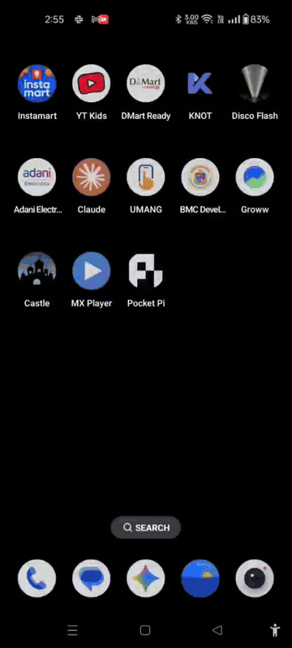

# Pocket Pi

A [Pi coding agent](https://pi.dev/) shipped as an Android APK. No Termux install, no shell setup — install the APK, paste an LLM key (or sign in to Claude Pro/Max), chat.

Pocket Pi is a thin Android wrapper around two upstream projects that do the real work:

- **[Pi coding agent](https://github.com/mariozechner/pi-coding-agent)** by [Mario Zechner](https://github.com/mariozechner) — the underlying agent engine. The canonical home is now [earendil-works/pi-coding-agent](https://github.com/earendil-works/pi-coding-agent).
- **[pi-agent-dashboard](https://github.com/BlackBeltTechnology/pi-agent-dashboard)** by [BlackBelt Technology](https://github.com/BlackBeltTechnology) — the web chat UI rendered inside the APK's WebView (slash commands, session history, model switcher, provider settings, OAuth flows). [pi-anthropic-messages](https://github.com/BlackBeltTechnology/pi-anthropic-messages) (also BlackBelt) is the Anthropic protocol bridge that makes Claude Pro/Max OAuth tokens usable from Pi.

What Pocket Pi adds is the packaging: a Termux runtime, postinstall script, an Android service that supervises `pi --mode rpc` + the dashboard's Node server, a Compose WebView with a small recovery UI for when the bootstrap stalls, and an on-device HTTP bridge (`127.0.0.1:9998`, per-launch bearer token) that lets the agent reach Android capabilities — notifications, intents, share-sheet, camera, mic, location, clipboard, deep-link inbox — without any companion APK.



## Install

1. Grab the latest APK — **v0.4.0** — from the [Releases page](https://github.com/CelestialCreator/pocket-pi/releases/latest), or directly: [pocket-pi-v0.4.0.apk](https://github.com/CelestialCreator/pocket-pi/releases/download/v0.4.0/pocket-pi-v0.4.0.apk) (68 MB, aarch64 only).
2. Sideload — tap the APK on the phone (allow install from unknown sources for your browser/file manager), or `adb install pocket-pi-v0.4.0.apk`. **On Android 13+ devices, Play Protect will warn and Accessibility may be blocked — see [Troubleshooting](#troubleshooting) below.**
3. Open the app. First launch runs the bootstrap (3–5 min on Wi-Fi: extracts Termux, installs Node + npm packages, registers Pi extensions).
4. When the dashboard loads, tap its **⚙** (top-right of the page chrome) → **Providers** → add at least one provider. See [Providers — what works](#providers--what-works) below.
5. Pick a model, chat away.

If the dashboard never finishes binding, the loading screen surfaces **Restart Pi** and **Re-run setup** buttons after a 15-second stall — those re-kick the service and re-run the bootstrap installer respectively. As a last resort, force-stop the app from Android Settings and reopen; the install state on disk is preserved.

## Providers — what works

The dashboard's Providers UI lists **two** sections: `SUBSCRIPTIONS (OAUTH)` and `API KEYS`. Not everything in the OAuth list works end-to-end on Pocket Pi today — the OAuth flow stores credentials, but actually *using* those credentials requires a Pi-side protocol bridge for each vendor. Only Anthropic's bridge is bundled.

| Provider | OAuth Sign-In | API Key | Notes |
|---|---|---|---|
| **Anthropic** (Claude Pro/Max) | ✓ end-to-end | ✓ | OAuth uses your `claude.ai` subscription quota via the bundled [`pi-anthropic-messages`](https://github.com/BlackBeltTechnology/pi-anthropic-messages) bridge. Sign-In opens your phone's default browser via an `xdg-open` shim → Android `ACTION_VIEW`. |
| **OpenAI** | — | ✓ | API key from `platform.openai.com`. |
| **Google Gemini** (AI Studio key) | — | ✓ | API key from `aistudio.google.com/app/apikey`. Recommended path for Gemini on Pocket Pi. |
| **Google Gemini CLI** OAuth | partial — Sign-In completes but unusable | n/a | Requires `GOOGLE_CLOUD_PROJECT` env var and a Pi-side `gemini-cli` bridge; neither is wired up. Use the AI Studio key instead. |
| **ChatGPT Plus/Pro (Codex)** OAuth | Sign-In completes but unusable | — | Codex protocol bridge not bundled. |
| **GitHub Copilot** OAuth | Sign-In completes but unusable | — | Copilot protocol bridge not bundled. |
| **Antigravity** OAuth | Sign-In completes but no models | — | No model catalog without a bridge. |
| **Groq** | — | ✓ | API key from `console.groq.com`. |
| **Mistral / xAI / Z.ai / OpenRouter / NVIDIA NIM** | — | ✓ | All use standard API-key paste. |

If you want to use Claude Pro/Max OAuth on Pocket Pi but prefer signing in on a different device, the manual flow works too: grab the auth URL the dashboard would have opened, sign in on your laptop browser, copy the `http://localhost:53692/callback?…` redirect URL out of the laptop's address bar, and open it in your phone's Chrome — the phone's Chrome will hit Pocket Pi's on-device callback server and finish the exchange.

## What's inside

| Layer | Component | Upstream |
|---|---|---|
| App shell | Android (Kotlin + Jetpack Compose) — `android/` | Pocket Pi |
| Linux runtime | Termux bootstrap (Node 25, Python, git, ripgrep, openssl) — `bootstrap/` | [Termux](https://termux.dev/) |
| Chat UI | [`@blackbelt-technology/pi-agent-dashboard`](https://www.npmjs.com/package/@blackbelt-technology/pi-agent-dashboard) — binds `:8000` (browser UI) + `:9999` (pi extension bridge); rendered in the app WebView. Slash commands, model switching, session history, provider settings, OAuth. | [BlackBelt Technology](https://github.com/BlackBeltTechnology/pi-agent-dashboard) |
| Agent engine | [`@earendil-works/pi-coding-agent`](https://www.npmjs.com/package/@earendil-works/pi-coding-agent), spawned as `pi --mode rpc` | [Mario Zechner](https://github.com/mariozechner/pi-coding-agent) / [earendil-works](https://github.com/earendil-works/pi-coding-agent) |
| Pi extensions | [`pi-anthropic-messages`](https://github.com/BlackBeltTechnology/pi-anthropic-messages) (Claude Pro/Max OAuth + tool-call rendering) + `pi-web-access`, `pi-subagents`, `oh-pi`, `@aliou/pi-guardrails`, `pi-mcp-adapter`, `pk-pi-hermes-evolve`, **`pi-termux-tools`** (Pocket Pi's phone-surface tools — notifications, intents, camera, mic, location, inbox) | various (see `bootstrap/npm-packages.txt`) + `extensions/pi-termux-tools/` |
| Compose-side UI | Loading / recovery pane only (Pocket Pi splash, postinstall log tail, inline `Restart Pi` + `Re-run setup` buttons after a 15s stall). Everything else lives in the dashboard's own settings UI. | Pocket Pi |
| Native bridges | **Localhost HTTP API** on `127.0.0.1:9998` (bearer token at `$PREFIX/etc/pocket-pi/api-token`, mode 0600, rotated per service start) exposing notify / share / intent / clipboard / battery / location / camera/photo / mic/record / inbox to the agent. `xdg-open` shim (postinstall) → Android `ACTION_VIEW`. Compose-side `PocketPi.notify/share/openExternal/toast` JS interface for the WebView. Share-target + `pi://agent/…` deep-link intent-filters queue payloads into `$HOME/.pi/agent/inbox/`. | Pocket Pi |

## Repo layout

```
.
├── android/                  Gradle Android project for the APK
├── bootstrap/                Termux bootstrap zip generator + postinstall
│   ├── build-bootstrap.sh     Layer our payload on upstream Termux's aarch64 zip
│   ├── postinstall.sh         First-run install: apt, npm, pip, pi install loop
│   ├── npm-packages.txt       Pi engine + extensions + peer deps
│   ├── packages.txt           Termux apt packages
│   ├── pip-packages.txt       Python deps (dspy etc, best-effort)
│   └── patches/               One-shot post-update patches (e.g. hermes-evolve)
├── config/                   Baked into the bootstrap at build time
│   ├── AGENTS.md              Always-on Pi context
│   ├── models.json            Provider/model registry (NVIDIA pre-filled)
│   └── claude-bridge.json     Wrapper config (legacy; not active)
├── extensions/               Our own Pi extensions (TypeScript)
│   ├── pi-termux-tools/       Phone surface tools (TTS, notify, share, camera)
│   └── pi-skill-learner/      Hermes-style learning loop
├── python/skill_learner_dspy DSPy reflection backend
├── skills/                   Pi Skills bundled into the bootstrap
└── scripts/                  Misc dev helpers
```

## Build from source

```bash
# 1. Bootstrap zip (produces bootstrap/dist/bootstrap-aarch64.zip, ~30M)
cd bootstrap && ./build-bootstrap.sh aarch64

# 2. (Optional) the custom Pi extensions
cd ../extensions/pi-termux-tools && pnpm install && pnpm build
cd ../pi-skill-learner       && pnpm install && pnpm build

# 3. APK
cd ../../android && ./gradlew :app:assembleDebug
# Output: android/app/build/outputs/apk/debug/app-debug.apk (~40 MB)
```

The current build uses `applicationId = com.termux` so the upstream Termux bootstrap binaries (which bake in the path `/data/data/com.termux/files/usr`) work without recompiling. To ship under a real app id, run `bootstrap/rebuild-with-prefix.sh` (Docker, 4–12 h on Apple Silicon) to produce a bootstrap pinned to a custom prefix, then flip `applicationId` in `android/app/build.gradle.kts`.

## What works / what doesn't (v0.4.0)

| | Status |
|---|---|
| Single-APK install on aarch64 phones | ✓ |
| pi-agent-dashboard as the WebView UI (slash commands, model switcher, session history all native) | ✓ |
| API-key chat for OpenAI / Anthropic API / Google Gemini (AI Studio) / Groq / Mistral / xAI / NVIDIA NIM / OpenRouter (tool use, cost tracking) | ✓ |
| Claude Pro/Max **OAuth** Sign-In → device default browser → on-device callback | ✓ |
| **Phone-surface tools for the agent** (notifications, share sheet, generic Android intents, dial, settings deep-links, clipboard, battery) | ✓ — new in v0.3.0 |
| **Location** (fused gps/network, foreground only) | ✓ — new in v0.3.0 |
| **Camera** (one-shot still capture, front/back) | ✓ — new in v0.3.0 |
| **Microphone** (record N seconds to AAC/.m4a) | ✓ — new in v0.3.0 |
| **Incoming intents** — "Share to Pocket Pi" target, `pi://agent/…` deep links, queued for the agent | ✓ — new in v0.3.0 |
| **`pocket-pi-api` shell shim** — `pocket-pi-api notify '{…}'`, `pocket-pi-api camera/photo '{…}'` etc. from any Termux session | ✓ — new in v0.3.0 |
| Recovery UI when the dashboard doesn't bind within 15s (inline Restart Pi / Re-run setup buttons) | ✓ |
| Other OAuth providers (Gemini CLI, ChatGPT Codex, GitHub Copilot, Antigravity) | sign-in completes but no models — Pi-side protocol bridges not bundled. Use the API-key path instead. |
| Shell-session feature inside the dashboard | not yet — `node-pty` has no android-arm64 prebuild and is stubbed; chat/files/tasks work, terminal tab will fail |
| **Mobile UI automation** (the agent reading other apps' screens, dispatching taps/swipes/text input/gestures, polling notifications + window-change events) | ✓ — new in v0.4.0. AccessibilityService vendored from [KarryViber/orb-eye](https://github.com/KarryViber/orb-eye) (MIT). One-time manual toggle in Settings → Accessibility → Pocket Pi (Android forbids runtime enablement). |
| **Baked-in `pocket-pi-android-control` skill** so sub-Opus models actually reach for the new tools — fallback chain (deep link → intent → launch by package + UI drive → verify), six worked examples (Clock timer, WhatsApp, Dark theme, Contacts, notification reactor, read-screen), anti-patterns, deep-link catalog. Drops into `~/.pi/agent/skills/` at first launch. | ✓ — new in v0.4.0 |
| Background location ("Allow all the time") | not yet — foreground only this release. Add the Settings escalation when a real use case appears. |
| `applicationId` ≠ `com.termux` | not yet — requires custom bootstrap rebuild |
| Old Android WebView builds (Chrome < ~120) | emulator system images ship stale WebView; real devices auto-update — confirmed working in Chrome 140+ |

## Troubleshooting

Two install-time gotchas on real Android 12+ devices that don't appear on the emulator. Both have one-time fixes.

### "Play Protect blocks the install"

When you tap the APK, Android's Play Protect scanner throws a scary "harmful app" warning and the install dialog defaults to **Cancel**. Pocket Pi isn't malicious — Play Protect just doesn't recognise it because it's not on the Play Store. Two recovery paths:

- **Easiest:** on the install dialog itself, tap **More details** → **Install anyway** (or **Install without scanning**). Doesn't change any system setting.
- **Or:** Settings → Google → Play Protect (gear icon, top right) → toggle **Scan apps with Play Protect** off → install → toggle it back on. Play Protect re-scans periodically; once Pocket Pi is installed, it stays trusted.

The signal is correct in spirit — Pocket Pi isn't on the Play Store. The APK source is the [Releases page on this repo](https://github.com/CelestialCreator/pocket-pi/releases/latest), so it's your own choice to trust it. Pocket Pi has no telemetry, no analytics, and no network calls of its own — everything that goes out is from your chosen LLM provider's SDK and the Pi agent runtime ([see Credits](#credits)).

### "Accessibility toggle is greyed out (Restricted settings)"

After tapping **Use Pocket Pi** in Settings → Accessibility, the toggle visibly does nothing. This is Android 13+'s "Restricted settings" mitigation, which blocks Accessibility for any APK not installed via Play Store — Pocket Pi included. The unlock is hidden but two taps away:

1. Settings → Apps → **Pocket Pi**
2. Tap the **⋮ menu** in the top-right corner of the App info screen *(on OxygenOS, MIUI, OneUI: scroll all the way to the bottom of App info instead — the same option lives there)*
3. Tap **Allow restricted settings** → confirm
4. Go back to Settings → Accessibility → **Pocket Pi** → toggle **Use Pocket Pi** — it now binds. Accept the system consent dialog ("Allow Pocket Pi to have full control of your device").

This affects every legitimate Accessibility consumer that's sideloaded — Tasker, Bitwarden autofill, KDE Connect all hit the same wall. v0.5's planned custom-prefix bootstrap unlocks the Play Store distribution path, which removes this step permanently.

## Credits

Pocket Pi is just packaging. The actual agent engine and the chat UI are someone else's work — Pocket Pi wouldn't exist without:

- **Pi coding agent** — [Mario Zechner](https://github.com/mariozechner) (original author) and the [earendil-works](https://github.com/earendil-works/pi-coding-agent) maintainers. The runtime that powers every chat turn, tool call, and skill in this app. See [pi.dev](https://pi.dev/).
- **pi-agent-dashboard** + **pi-anthropic-messages** — [BlackBelt Technology](https://github.com/BlackBeltTechnology). The web chat UI rendered inside the APK's WebView, plus the Anthropic protocol bridge that makes Claude Pro/Max OAuth work end-to-end.
- **Termux** — the Termux maintainers. The Linux-on-Android runtime that lets us ship Node, Python, and the rest inside a single APK without root or a custom ROM.
- **orb-eye** — [KarryViber](https://github.com/KarryViber/orb-eye). The AccessibilityService that powers v0.4's UI-automation surface; vendored under MIT with attribution preserved in the source header.

Pi extension ecosystem authors are credited individually in each package's `package.json`; see `bootstrap/npm-packages.txt` for the install list.

## License

MIT for Pocket Pi's own source. Third-party runtime components keep their own licenses (Termux GPL, Pi MIT, pi-agent-dashboard's license, etc.) — see each upstream repo for details, and `LICENSE` for the Pocket Pi terms.

## Status

**v0.4.0 — agent has the phone and the screen.** Daily-drivable. On top of the v0.3 phone surface (notifications, intents both directions, share-sheet, camera, mic, location, clipboard, deep-link inbox), v0.4 adds a full UI-automation surface via a vendored [KarryViber/orb-eye](https://github.com/KarryViber/orb-eye) AccessibilityService: the agent can read any app's element tree, find by text/desc/id, dispatch taps / swipes / long-presses / scrolls / multi-finger gestures, set text on focused fields, take screenshots (API 30+), fire global actions (back/home/recents/notifications), buffer system notifications, and long-poll a window-change + notification event channel for proactive behaviour. All gated by the same per-launch bearer token over localhost. No companion APK, no root, no shell setup; one manual Accessibility toggle in Settings on first run (Android requirement — Pocket Pi deep-links there from its onboarding pane).

Bundled alongside the tools is a **baked-in `pocket-pi-android-control` skill** at `~/.pi/agent/skills/pocket-pi-android-control/SKILL.md`. Shipping the tools alone wasn't enough — emulator testing showed sub-Opus models (qwen-flash, etc.) would call `pocket_pi_intent_send` once, hit a wall, and give up. The skill anchors the fallback chain (deep link → generic intent → launch by package + UI drive → verify) with six worked examples and anti-patterns. With it loaded, the same models that bailed without it now complete full chains end-to-end.

Roadmap from here, in rough priority order:

- **v0.5 — working shell-session tab** in the dashboard once a viable `node-pty` android-arm64 prebuild exists (currently stubbed; terminal tab is the last dashboard feature without backing).
- **Background location escalation** when a real use case lands ("Allow all the time" → `ACCESS_BACKGROUND_LOCATION`).
- **More OAuth providers** end-to-end (Gemini CLI, ChatGPT Codex, GitHub Copilot, Antigravity) — each requires a small Pi-side protocol bridge analogous to `pi-anthropic-messages`.
- **Custom-prefix bootstrap** so `applicationId` can move off `com.termux`. Currently a 4–12 h Docker build on Apple Silicon; once it's clean, the path to a real signed release on Play Store is short.

---

⭐ **If Pocket Pi is useful to you, please consider giving the repo a star** — it genuinely helps others discover the project. Bug reports, deep-link recipes for your favorite apps, and translations are all warmly welcomed → [good first issues](https://github.com/CelestialCreator/pocket-pi/labels/good%20first%20issue).
